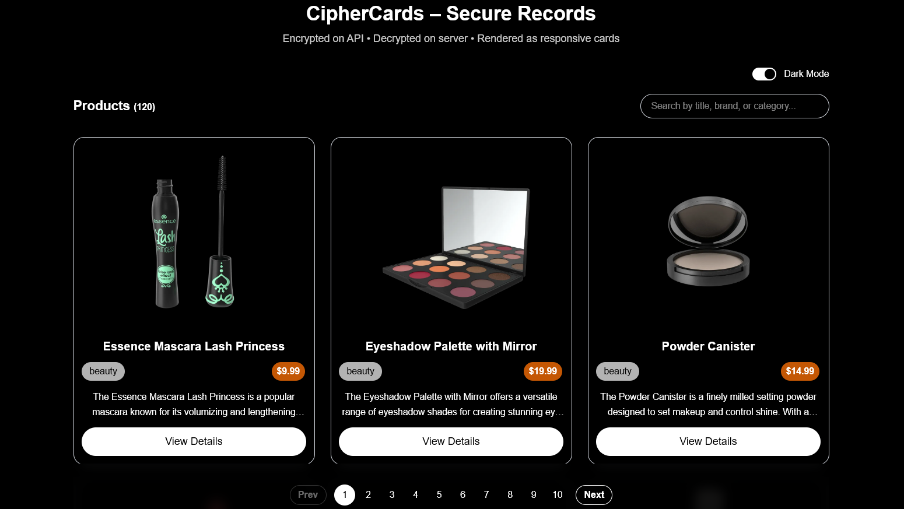
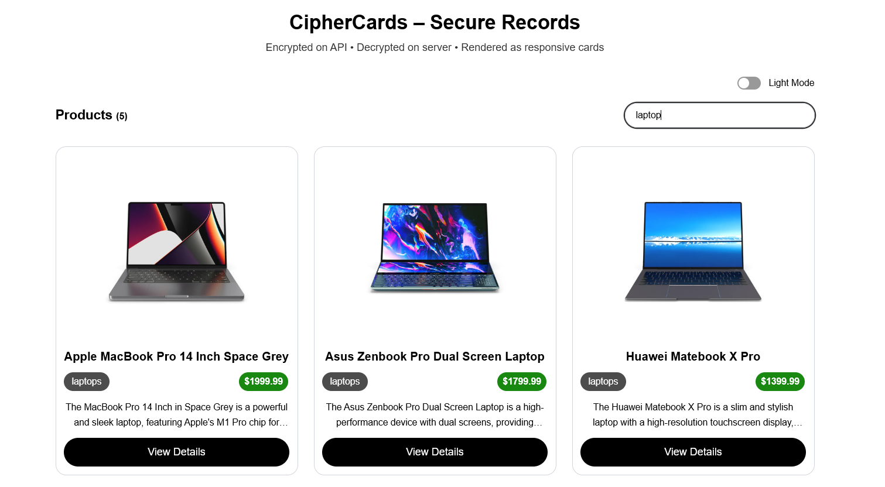

# 🔐 CipherCards – Secure Product Grid (Next.js + Tailwind)

A modern **Next.js (App Router) + TypeScript** application that demonstrates:

- Secure **server-side encryption/decryption** using Node crypto
- **Server-Side Rendering (SSR)** with decrypted data (no secrets on client)
- A **responsive, animated card grid** using Tailwind CSS
- **Search with deferred filtering**
- **Pagination component**
- **Light / Dark theme toggle**
- **Sticky header and footer**
- **Skeleton loading UI**

Data is sourced from `DummyJSON`, **encrypted on an internal API route**, and **only decrypted on the server** before rendering.

---

## ✨ Features

### ✅ Security
- Encrypted API payload using **symmetric encryption**
- Encryption key stored in `.env.local`
- Decryption performed **only during SSR**
- No plaintext data is exposed to client-side API calls

### ✅ UI / UX
- Responsive card layout  
  - 1 column on mobile  
  - 2 columns on tablet  
  - 3 columns on desktop  
- Product cards 
- Sticky header (Search bar)
- Sticky footer (Pagination)
- Search with `useDeferredValue`
- Skeleton loading screen
- Light / Dark mode toggle

### ✅ Tech Stack
- Next.js (App Router)
- TypeScript
- Tailwind CSS
- React Hooks
- Node Crypto
- DummyJSON API

---

## 📸 UI Preview

### Dark Mode

### Light Mode

